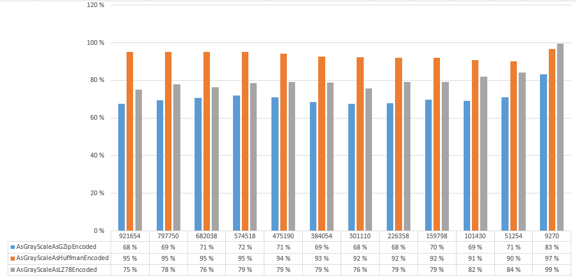
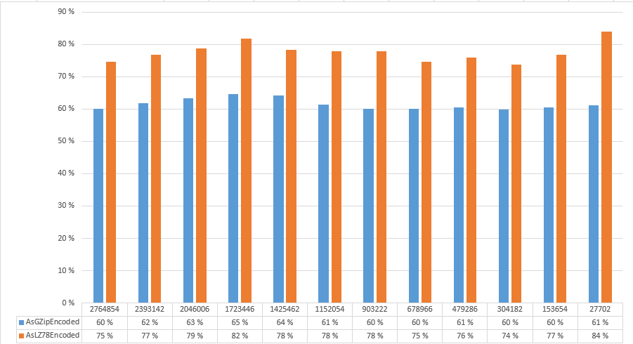

# Testausdokumentti

## Mitä on testattu, miten tämä tehtiin

### Yksikkötestaus

Yksikkötestaukseen on käytetty XUnit testauskehikkoa. Yksikkötestauksissa testattu ohjelman toiminnallisuuksia ja joita yksikköjä on testattu erikseen. Käytännössä testit ajettiin Visual Studion yksikkötestaus työkalun kautta. Testikattavuusraportin tiedot ajettiin myös Visual Studion kautta ja tulokset tallennettiin XML-muotoiseen tiedostoon nimeltä latest.coveragexml. Testiraportin ulkoasun generoimiseen käytettiin ReportGenerator ohjelmaan, joka ladattiin Nuget pakettina testiohjelmaan. ReportGenerator ohjelma suorittettiin komentokehotteesta komennolla

>dotnet %UserProfile%\.nuget\packages\reportgenerator\4.6.4\tools\netcoreapp2.1\ReportGenerator.dll "-reports:latest.coveragexml" "-targetdir:coveragereport" -reporttypes:Html  

ReportGenerator tallensin raportin ulkoasun tiedostot hakemistoon *coveragereport*, jonka voi katsella <a href="https://htmlpreview.github.io/?https://github.com/kallepaa/high-speed-image-stream-compress/blob/master/StreamCompressTest/coveragereport/index.html" target="_blank">tästä linkistä</a>

### Suorituskykytestaus

Suorituskykytestauksissa vertailuna käytettiin .Net Core Frameworkin omaa GZip toteutusta, jonka on ohjelmassa yhtenä pakkausvaihtoehtona.

Kaikissa testauksissa käytettiin yhtä alkuperäistä kuvaa 00000-original.bmp, joka löytyy hakemistosta StreamCompressTest/TestData/Source

#### Suoritusnopeus ja muistinkäyttö

Suoritusnopeuden testaamiseen käytettiin BenchmarkDotNet testauskehikkoa. Testeissä testattiin kaikkien pakkaustoteutusten enkoodaus- ja dekoodaus nopeutta eri syötteillä. Testit löytyvät StreamCompressBenchmark projektin Benchmarks.cs tiedostosta. 

* EncodeAndDecode - testaa suoritusnopeutta alkuperäisellä kuvalla
* EncodeAndDecodeGrayScale - testaa suoritusnopeutta alkuperäisen kuvan harmaasävyiseksi muutettua kuvaa eri harmaasävyiden määrillä
* EncodeAndDecodeCroppedGrayScale - testaa suoritusnopeutta alkuperäisen kuvan harmaasävyiseksi muutetun kuvan eri kooilla
* EncodeAndDecodeCropped - testaa suoritusnopeutta alkuperäisellä kuvan eri kooilla
* EncodeAndDecodeHashTablePrime - testaa suoritusnopeutta alkuperäisen kuvan pakkaamista LZ algoritmilla käyttäen hajatustaulussa eri prime arvoja
* EncodeAndDecodeTrieCapacity - testaa suoritusnopeutta alkuperäisen kuvan pakkaamista LZ algoritmilla käyttäen trie totetusta ja eri taulukkojen koon alkuarvoja

Kaikki suorituskykymittauksen tulokset löytyvät [täältä](StreamCompressBenchmark/results/StreamCompressBenchmark.report-github.md)

#### Pakkausteho
 
Pakkausteho testattiin sekä värikuvalla ja harmaasävyisellä kuvalla, sekä niiden eri kooilla. 

Käytetyt pakkaus metodit olivat 

**Harmaasävy**

* AsGrayScaleAsGZipEncoded (vertailu)
* AsGrayScaleAsHuffmanEncoded
* AsGrayScaleAsLZ78Encoded

 Harmaasävyisen kuvan pakkaustehon vertailu

**Värikuva**

* AsGZipEncoded (vertailu)
* AsLZ78Encoded

 Värikuvan pakkaustehon vertailu

## Minkälaisilla syötteillä testaus tehtiin (vertailupainotteisissa töissä tärkeää)

### Yksikkötestaus
Syötteinä käytettiin oikeita kuvia, sekä jossain testeissä generoitua dataa.

### Suorituskykytestaus

Syötteenä käytettiin yhtä kuvaa, josta muokattiin harmaasävyisiä kuvia, sekä kuvaa pienennettiin. 

## Miten testit voidaan toistaa

### Yksikkötestaus
Yksikkötestaukset voidaan ajaa Visual Studion kautta.

### Suorituskykytestaus

#### Suoritusnopeus ja muistinkäyttö

Ajamalla StreamCompressBenchmark kansiossa oleva run.cmd komentojonotiedosto  windows ympäristössä. Vastaa komentojonotiedostoa ei valitettavasti ole Linux ja Mac ympäristöihin.

#### Pakkausteho

Ajamalla StreamCompress kansiossa oleva run.cmd komentojonotiedosto  windows ympäristössä. Vastaa komentojonotiedostoa ei valitettavasti ole Linux ja Mac ympäristöihin.

