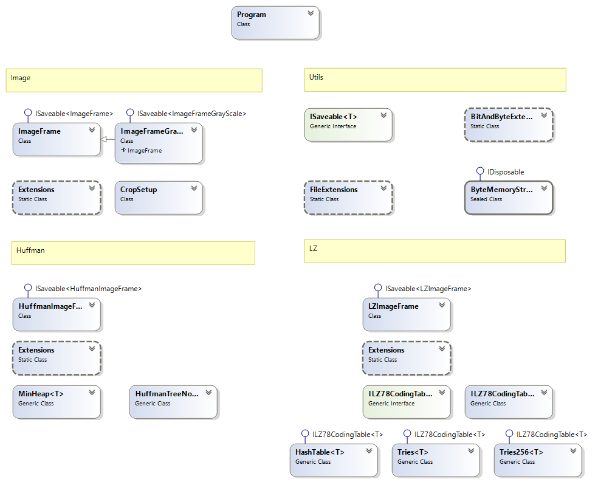

# Toteutusdokumentti

## Ohjelman yleisrakenne

### Luokkakaavio

 Luokkakaavio

### Pääohjelma (Program)

Pääohjelma on toteutettu luokkaan Program. 
Tarkempi kuvaus pääohjelman käyttämisestä [käyttöohjeesta](kayttoohje.md).

### Ohjelman domain luokat ja niiden laajennukset, sekä rajapinnat

Ohjelman domain luokat ja niiden rajapinnat on ryhmitelty omien nimiavaruuksien. 
Luokkien laajennukset ovat myös omien nimiavaruuksien alla.

#### Domain.Image ja DomainExtensions.Image 

ImageFrame ja ImageFrameGray luokat ilmentävät yhtä bittikartta kuvaa. ImageFrame on 24 bittinen kuva ja ImageFrameGrayScale on 8 bittinen kuva.

ImageFrame ja ImageFrameGray luokkien kuvien muunnokset ja pakkaukset on toteutettu laajennuksissa.

CropSetup on apuluokka, joka koostaa kuvan kroppauksen arvot yhteen luokkaan.

##### Tuettuja toimintoja

* Kuvan muuntaminen 24 bit värikuvasta 8 bittiseksi harmaasävyn kuvaksi
* Kuvan kroppaaminen
* Kuvan sijoittaminen uuden suuremman kuvan keskelle
* 8 bittisen harmaasävyisen kuvan enkoodaus Huffman koodauksella
* Kuvan enkoodaus LZ koodauksella

#### Domain.Huffman ja DomainExtensions.Huffman

HuffmanImageFrame ilmentää huffman enkoodattua dataa. Tällä hetkellä toteutus tukee vain 8 bittistä harmaasävyistä kuvaa, joka voidaan dekoodata takaisin alkuperäiseksi.

Enkoodaus ja dekoodaus hyödyntävät MinHeap ja HuffmanTreeNode luokkia.

#### Domain.LZ ja DomainExtensions.LZ

LZImageFrame ilmentää LZ enkoodattua dataa. Enkoodaus ja dekoodaus tukevat mitä tahansa dataa.

ILZ78CodingTable rajapinnan toteuttavia luokkia voidaan käyttää hakemistona koodauksessa. Tällä hetkellä toteutettuna on HashTable ja Trie hakemistot. 

### Utils - IO ym. muut tarvittavat laajennukset

* FileExtensions pitää sisällään IO operaatiot
* BitAndByteExtensions pitää sisällään tavujen ja bittien käsittelyyn tarvittavia operaatioita
* ISaveable rajapinnan avulla sen totteuttavat "Frame" luokat voidaan lukea ja tallentaa levylle
* ByteMemoryStream luokka piilottaa MemoryStream toteutuksen muistiin kirjoittamista varten

## Saavutetut aika- ja tilavaativuudet (m.m. O-analyysit pseudokoodista)

### Kuvien muokkaus

Kuvien muokkaamiseen käytetyt algoritmit ovat pääsäntöisesti O(N), joissa käytännössä luetaan kuvan dataa horisontaalisesti ja vertikaalisesti kahdessa sisäkkäisessä iteraatiossa. Tilavaatimus on myös O(N). Käytännössä luodaan uusi kuva joka pienempi tai suurempi edellinen, mutta kuitenkin suurin piirtein saman kokoinen eli ~2*N.

### Huffman koodaus

#### Enkoodaus

Huffman koodauksessa on käytetty kurssin materiaaleissa ollutta kekototeutuksen esimerkkiä ja muunnettu se vain maksimikeosta minimikeoksi. Minikeon operaatioista käytetään vain Insert ja DelMin operaatioita. Suoraan materiaalista katsottuna yhden DelMin operaation aikavaatimus on O(log n) kuten myös Insert operaation. Koodauksessa kuitenkin joudutaan käymään syötteen kaikki tavut läpi pariin kertaan, joten algoritmin aikavaatimus on O(n log n). Tilavaatimus muodostuu syötteen, enkoodatun paluuarvo ja keon, sekä aputaulun tarvitsemasta tilasta. Keon tilavaatimus riippuu paljolti syötteestä. Olettaisin että tilavaatimus on kuitenkin O(N) ja keon merkitys kokonaisuudessa pieni.

### LZ koodaus

LZ koodauksessa on käytetty LZ78 koodausta, jossa pääasiallisesti aikavaatimus tulee lisäyksistä ja hauista hakemistoon. Rungon toteutus perustuu löytämääni pseudokoodiin [LZ78]. Hakemistoiksi olen tehnyt hajaustaulun ja trie hakemistot. Käytännössä LZ koodaus tarvitsee vain hakemiston lisäys- ja hakuoperaatioita.

### Enkoodaus
LZ algoritmi itsessään käy syötteen tavu kerrallaan läpi, joten sen aikavaatimus on O(N). 

##### Hajautustaulu

Hajautustaulun toteutus on pääsäntöisesti totetutettu kurssinmateriaalin perusteella. Kuitenkin koska tässä työssä käsitellään avaimia (K), joiden pituus voi olla pitkiäkin, on hajautusavaimen laskemiseen käytetty FNV [FNV] menetelmän C# totetusta, joka on kopioitu suoraan StackOverFlowsta. Varsinaisen taulun indeksin laskemiseen on käyetty jakojäännösmenetelmää. Ylivuodotojen käsittellyyn on käytetty ketjutusta.

Kurssimateriaalin perusteella lisäysoperaation kesto olisi vakioaikainen O(1) ja hakuoperaation keskimäärin vakioaikainen, joten enkoodauksen aikavaatimus olisi O(N)

#### Trie

Trie algoritmin totetukseen käytin Youtube videota [Trie], jossa kuvattiin Trie algoritmin periaatteet. Hakuoperaatoiden kesto riippuu hakutekijän pituudesta m, joten sen aikavaatimus on O(m). Lisäys operaation on myös O(m), koska se käytännössä on melkein sama kuin haku. Näin ollen Trie hakemistoa käytettäessä aikavaatimus olisi O(mN). Trie algoritmin tilavaatimus voi olla suuri koska jokainen solmu saattaa sisältää useita null pointtereita. Omassa totetuksessa tein solmujen linkitystaulun kasvavaksi tarpeen mukaan, jonka pitäisi vähentää null pointtereiden määrä. 

## Suorituskyky- ja O-analyysivertailu (mikäli työ vertailupainotteinen)

## Työn mahdolliset puutteet ja parannusehdotukset

* Hajautustaulun hajautus on selkeästi alue jota pitäisi parantaa, jos hakuavaimet ovat pitkiä kuten ne nyt ovat. Tällöin päästäisiin usemammin vakioaikaisiin hakuihin ja lisäyksiin.
* Teknistä totetusta voi parantaa varmasti paljon, jotta muistin käyttö olisi parempaa
* Enkoodatun datan tarvitsemaa tilaa voisi optimoida
* Mahdollisesti hakemistojen yhteiskäytöllä voisi saada parannuksia suorituskykyyn. Esim. käyttämällä trie hakemistoa lyhyisiin avaimiin ja pidemmät avaimet käsiteltäsiin hajautuksella. 

## Lähteet

* [LZ78](https://toodle2.cs.huji.ac.il/nu15/pluginfile.php/413566/mod_resource/content/3/Lecture-15-10-Compression.pdf)
* [FNV](https://stackoverflow.com/questions/16340/how-do-i-generate-a-hashcode-from-a-byte-array-in-c/16381)
* [Trie](https://www.youtube.com/watch?v=-urNrIAQnNo)